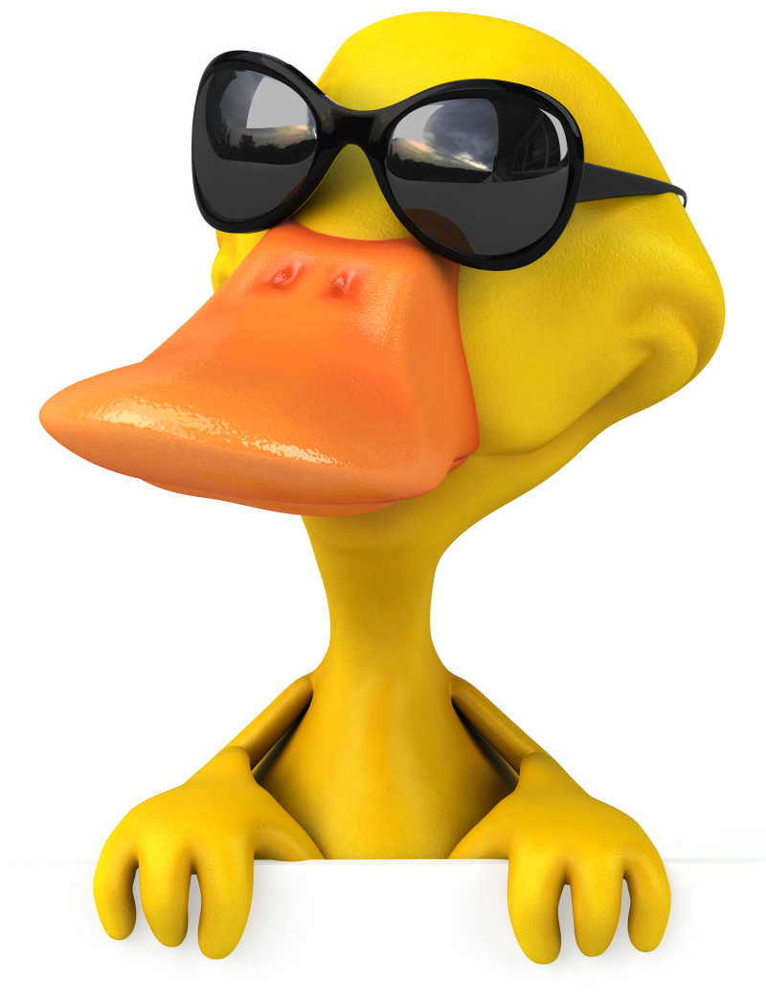
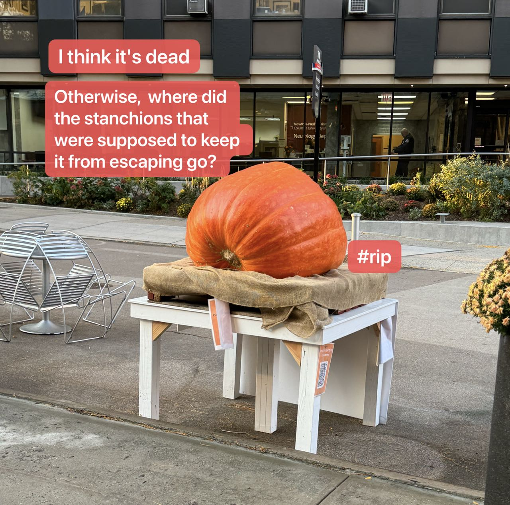
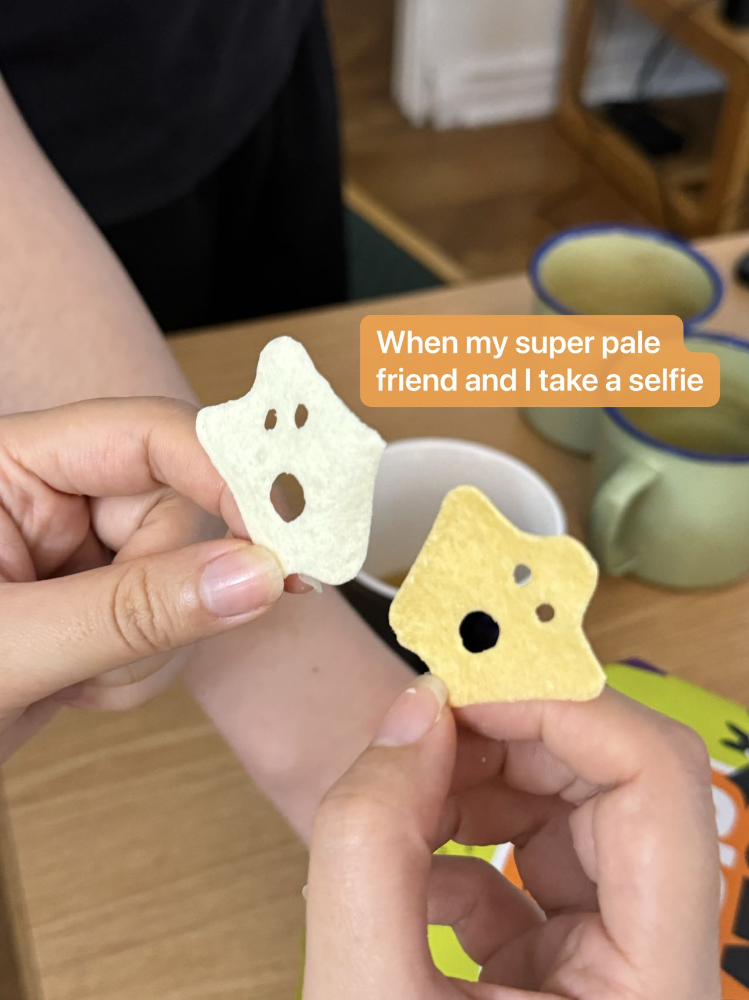
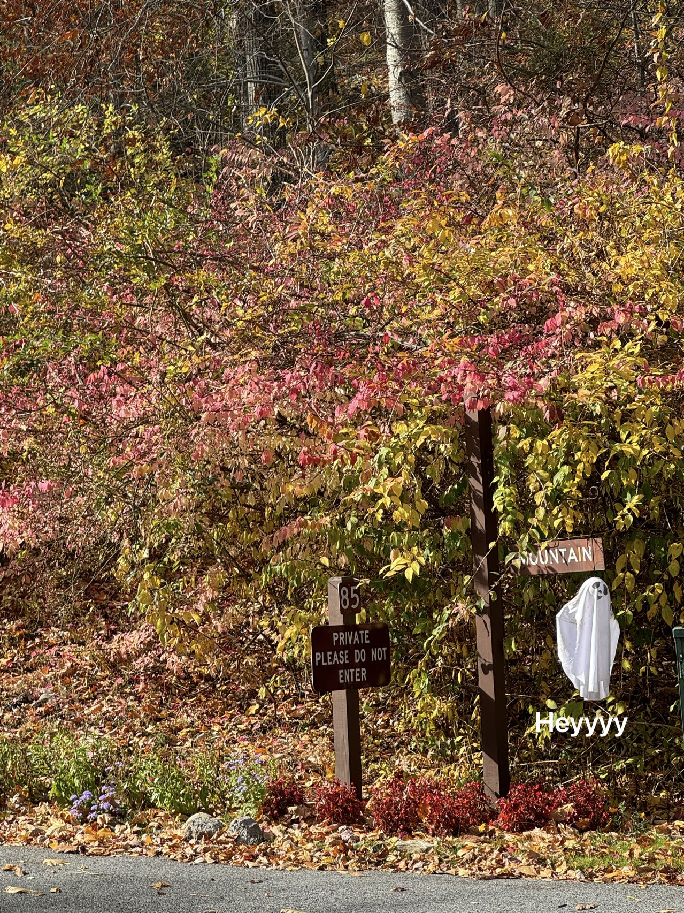

# Who am I? 

Welcome! This is Yaya's personal website. Take a look and know something about me! 

I’m currently a second-year Master’s student in Biostatistics at Columbia’s Mailman School of Public Health, where I’m also pursuing an Advanced Epidemiology certificate. I grew up in Ningbo, Zhejiang, and completed my undergraduate studies in Neuroscience at Boston College. My goal for learning more quantitative and analytical skills led me to explore the field of Biostatistics.

While my work often involves meticulous scientific analysis, creativity is something I deeply value. For me, beauty exists in every form of art, from spontaneous inspirations to the bubbling expressions of emotion. Science, is a mission, a way to contribute to the world. Creativity is an aspiration, a way to enrich life through exploration and expression.

Of-course, it is better to combine the two----but haven’t quite cracked that code yet! If you have any ideas/suggestions, I’d *love* to hear them – that would be incredibly exciting!

# Hobby

Loves food! Traveling! Doing random things! 

*Recent random things*

# Network

Feel free to connect with my [linkedin](www.linkedin.com/in/jiayi-li-9b32441b9); take a look at my [GitHub](https://github.com/yayayyds1122); and shoot me an email [here](jl6521@columbia.edu)!
